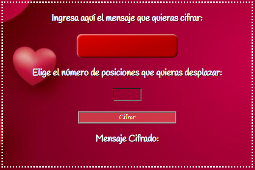
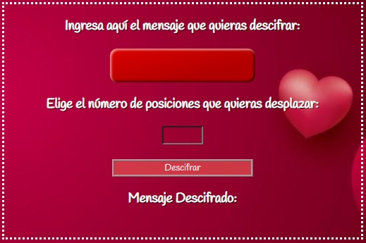
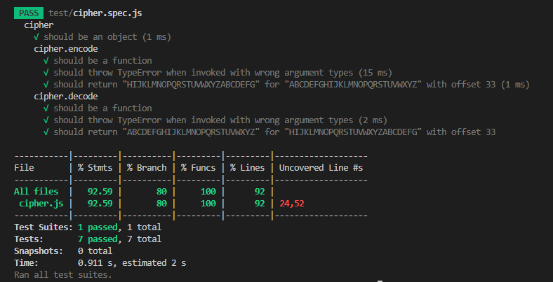
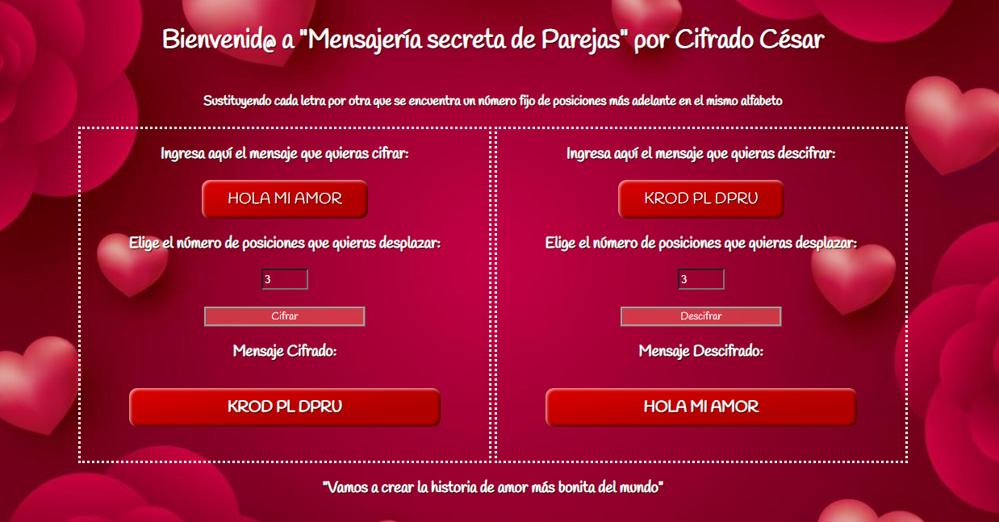

# Cifrado César

## Índice

* [1. Preámbulo](#1-preámbulo)
* [2. Resumen del proyecto](#2-resumen-del-proyecto)
* [3. Hito: Criterios de aceptación mínimos del proyecto](#4-hito-criterios-de-aceptación-mínimos-del-proyecto)
* [4. Hito Opcional: Agrega soporte para minúsculas y otros caracteres](#5-hito-opcional-agrega-soporte-para-minúsculas-y-otros-caracteres)

***

## 1. Preámbulo

Cifrar significa ocultar el contenido de un mensaje a simple vista, de manera
que sólo las partes autorizadas pueden descifrar un texto cifrado.
El [cifrado César](https://en.wikipedia.org/wiki/Caesar_cipher)
es uno de los primeros métodos de cifrado conocidos. El emperador romano Julio
César lo usaba para enviar órdenes secretas a sus generales en los campos de
batalla.

El cifrado césar es una de las técnicas más simples para cifrar un mensaje. Es
un tipo de cifrado por sustitución, es decir que cada letra del texto original
es reemplazada por otra que se encuentra un número fijo de posiciones
(desplazamiento) más adelante en el mismo alfabeto.

Por ejemplo, si usamos un desplazamiento (_offset_) de 3 posiciones:

* La letra A se cifra como D.
* La palabra CASA se cifra como FDVD.
* Alfabeto sin cifrar: A B C D E F G H I J K L M N O P Q R S T U V W X Y Z
* Alfabeto cifrado: D E F G H I J K L M N O P Q R S T U V W X Y Z A B C

En la actualidad, todos los cifrados de sustitución simple se descifran con
mucha facilidad y, aunque en la práctica no ofrecen mucha seguridad en la
comunicación por sí mismos; el cifrado César sí puede formar parte de sistemas
más complejos de codificación, como el cifrado Vigenère, e incluso tiene
aplicación en el sistema ROT13.

## 2. Resumen del proyecto

En ésta página encontrarás una manera segura de cifrar los mensajes que quieras compartir con tu pareja y así evitar que sean vistos por terceros. Dirigido a toda persona que quiera darle un poco de diversión y privacidad a su relación.

 Bienvenid@ a "Mensajería secreta de parejas" por Cifrado César

Sustituyendo cada letra por otra que se encuentra un número fijo de posiciones más adelante en el mismo alfabeto.
Lo cual te permite divertirte y a la vez mantener tu privacidad a la hora de enviar o recibir mensajes.

"Vamos a crear la historia de amor más bonita del mundo"

### Los objetivos generales de este proyecto son los siguientes

* Trabajar en base a un boilerplate, la estructura básica de un proyecto en
  distintas carpetas (a través modulos en JS).
* Conocer las herramientas de mantenimiento y mejora del código (linters y
  pruebas unitarias).
* Aprender sobre objetos, estructuras, métodos e iteración (bucles)
  en JavaScript
* Implementar control de versiones con git (y la plataforma github)

## 3. Hito: Criterios de aceptación mínimos del proyecto

Estos son los requisitos que tu proyecto debe que cumplir para asegurar que tu trabajo
cubra los objetivos principales.  

**1. Una interfaz que debe permitir a la usuaria:**

* **Cifrar un mensaje**
  - Inserta el mensaje que quiere cifrar.
  
  - Elige el número de posiciones que quieras desplazar el alfabeto
    
  - Como resultado tendrás el mensaje cifrado.

  

* **Descifrar un mensaje**
   - Inserta el mensaje que quiere descifar.
  
  - Elige el número de posiciones que quieras desplazar el alfabeto
    
  - Como resultado tendrás el mensaje descifrado.

  

**2. Pruebas unitarios de los métodos.**  
Los metódos de `cipher` (`encode` y `decode`) fueron testeados con
pruebas unitarias.

**3. Código de tu proyecto subido a tu repo y interfaz "desplegada".**  
El código final se encuentra subido en un repositorio en GitHub.  
La interfaz o pagina web, se desplega usando GitHub Pages.

**4. Un README que contiene una definición del producto.**  

## 4. Hito Opcional: Agrega soporte para minúsculas y otros caracteres

En este espacio, profundicé logrando que en la interfáz se reconozcan los espacios ingresados en cada mensaje.
